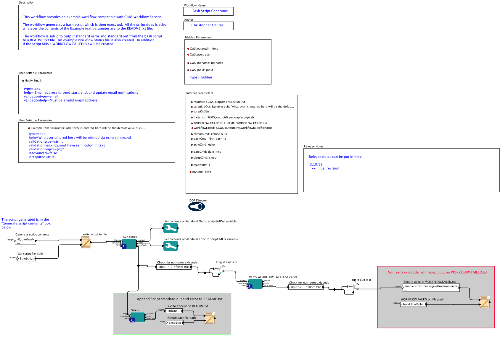
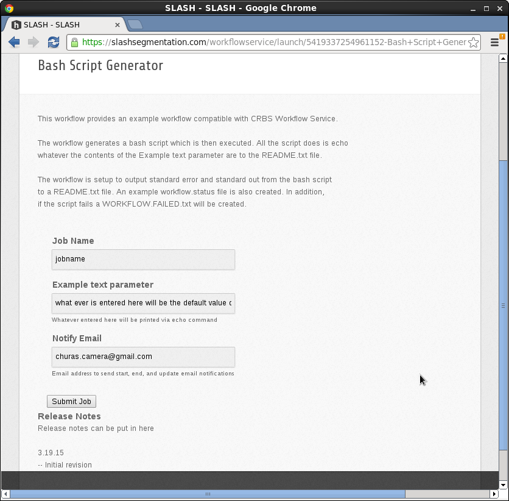

Bash Script Generator Workflow
==============================

This workflow provides an example workflow compatible with CRBS 
Workflow Service.
 
The workflow generates a bash script which is then executed.  All the 
script does is echo whatever the contents of the Example text parameter 
are to the README.txt file.
 
The workflow is setup to output standard error and standard out from 
the bash script to a README.txt file.  An example workflow.status file 
is also created.  In addition, if the script fails a 
WORKFLOW.FAILED.txt will be created. 

Screenshot of the workflow
--------------------------

Workflow in the portal
----------------------

NOTES
-----

The generation of the bash script has a few issues.  The dollar
sign is a special character in Kepler used to reference canvas 
parameters.  To use a script variable 2 dollar signs ($$) are needed.  
If a single dollar sign is used on a variable, Kepler will try to look 
for it on the canvas and complain if its not there when ok is clicked 
on the dialog for the script text box.

If Kepler has problems parsing the generated script, Kepler will 
arbitrarily remove the dollar sign characters from the the script 
causing huge headaches.  This problem means its best to only do this 
approach for simple scripts.

Finally, renaming Kepler canvas parameters is tricky because Kepler
will complain and possibly screw up the script text if a Kepler 
canvas parameter is referenced in the script text.  The only work
around is to remove all Kepler canvas parameter references before
removing or renaming a Kepler canvas parameter.

